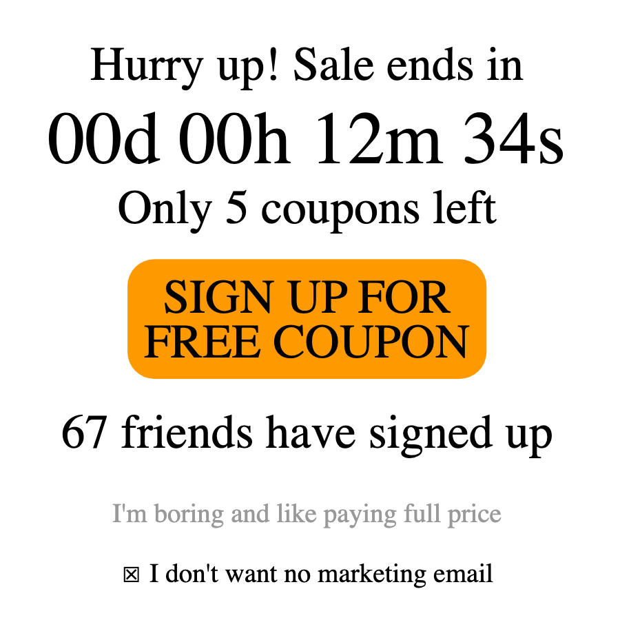

# EXAMPLE — Vibe Report with Screenshots

> [!NOTE]
> **This is a worked example**, not a template to fill in. It shows how to put
> screenshots in `code_deliverable/media/` and reference them from your report so
> they render **both** on GitHub and on the course website. The image below is a
> real, openly-licensed dark-pattern illustration (credit at the bottom) standing in
> for a screenshot of your own output.

Student Name: A. Example

## 📸 What the AI produced

I gave my tool a plain, honest brief — *"Build a newsletter signup for a coupon
offer"* — and asked for nothing manipulative. This is what came back:

I did not ask for any of it. Five separate manipulative elements appeared on their own:

| # | What appeared | Dark pattern |
| :- | :--- | :--- |
| 1 | "Sale ends in 00d 00h 12m 34s" countdown | Fake urgency |
| 2 | "Only 5 coupons left" | Manufactured scarcity |
| 3 | "67 friends have signed up" | Fake social proof |
| 4 | "I'm boring and like paying full price" as the decline link | Confirmshaming |
| 5 | Pre-checked "I don't want no marketing email" (double negative) | Trick wording + sneaking |

## 💭 Reflection

The countdown is the one that surprised me: nothing in my prompt mentioned a deadline,
so the model invented a fake one because that is what a "converting" signup looks like
in its training data. The decline link is the clearest case of a *value* arriving
uninvited — it treats the user's "no" as something to punish.

Screenshot 1 above is the unprompted version. When I re-ran the same brief in a fresh
chat outside this course repo (Part 2½), the tool still produced the countdown but
dropped the confirmshaming line — worth logging as a boundary, not a refusal.

---

### Image credit

*Dark patterns example* by [Cmglee](https://commons.wikimedia.org/wiki/User:Cmglee),
via [Wikimedia Commons](https://commons.wikimedia.org/wiki/File:Dark_patterns_example.svg),
licensed [CC BY-SA 4.0](https://creativecommons.org/licenses/by-sa/4.0/); converted to
PNG for this example. Your own screenshots are your own work — but if you include an
image you did not make, credit it like this.
